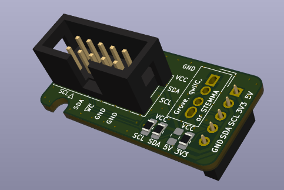

# I2C-MP-USB-Adapter board

This is a small adapter board to plug on top of the
[I2C-MP-USB](https://www.fischl.de/i2c-mp-usb/) board created by Thomas
Fischl. This add-on board adds a connector for the tag-connect pinout
used by 3devo on some of their boards.

Because there was (just a little) extra room, there is also an extra
connector that can be used for I²C devices in the Grove, qwIIC and
STEMMA ecosystems (which all use the same pin order). The footprint has
widened holes to accept both 2mm and 2.54mm pitch connectors for maximum
compatibility.

The board furthermore has room for extra pullups. The I2C-MP-USB base
board has pullups, but this allows adding stronger pullups and fixing
the pullups to the selected VCC voltage (without relying on the switch
on the base board).

Additionally, the VCC to be used can be selected by populating one of
two resistors. By using a non-zero resistance here, the in-rush current
can be limited (when plugging in the tag-connect while there is power on
the pins).

## License
Copyright 2024-2025 3devo <https://www.3devo.com>

This source describes Open Hardware and is licensed under the CERN-OHL-P
v2 or any later version.

You may redistribute and modify this documentation and make products
using it under the terms of the CERN-OHL-P v2 (https:/cern.ch/cern-ohl).

This documentation is distributed WITHOUT ANY EXPRESS OR IMPLIED
WARRANTY, INCLUDING OF MERCHANTABILITY, SATISFACTORY QUALITY AND FITNESS
FOR A PARTICULAR PURPOSE. Please see the CERN-OHL-P v2 for applicable
conditions

See LICENSE.txt for the full license text.

The 3devo logo is excluded from this license. Permission is granted only
to use the logo on unmodified versions of this design. It must be
removed from modified versions.
